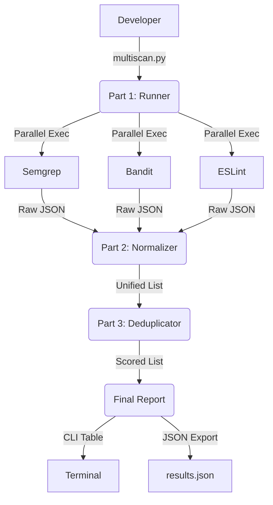

# 🔍 MultiScan CLI

**One command. Multiple analyzers. Zero noise.**

MultiScan CLI is a unified security orchestration tool designed to run multiple static analysis tools simultaneously, normalize their outputs, and provide a deduplicated, prioritized report. It solves the "tool fatigue" problem by merging overlapping alerts from different scanners into a single, high-confidence finding.

---

## 🚀 Key Features

- **Parallel Orchestration**: Runs `Semgrep`, `Bandit`, and `ESLint` concurrently using a multi-threaded runner.
- **Intelligent Deduplication**: Merges findings that share similar locations (±5 lines), CWE IDs, or message tokens.
- **Confidence Scoring**: Prioritizes alerts using a mathematical formula:  
  `0.4*ToolAgreement + 0.25*Severity + 0.2*CWEAgreement + 0.15*LocationOverlap`
- **Baseline Mode**: Filter out known findings to focus only on new vulnerabilities.
- **Unified Schema**: Normalizes messy tool outputs into a clean, actionable JSON format.

---

## 🛠️ Architecture



---

## 📦 Installation

### 1. Prerequisites
Ensure you have the core security tools installed on your system:
- **Semgrep**: `brew install semgrep` or `pip install semgrep`
- **Bandit**: `pip install bandit`
- **ESLint**: `npm install -g eslint` (Ensure `eslint-plugin-security` is configured in your target)

### 2. Setup MultiScan
```bash
# Clone the repository
git clone https://github.com/your-repo/multiscan-cli.git
cd multiscan-cli

# Create and activate virtual environment
python3 -m venv .venv
source .venv/bin/activate

# Install dependencies
pip install -r requirements.txt
```

---

## 🖥️ Usage

### Basic Scan
Scan a directory and let MultiScan auto-detect the language:
```bash
python3 multiscan.py --target ./myapp
```

### Language Filtering
Focus on a specific tech stack:
```bash
python3 multiscan.py --target ./myapp --lang python
```

### Baseline Mode (Extension)
Only show new findings compared to a previous scan:
```bash
python3 multiscan.py --target ./myapp --baseline previous_report.json
```

---

## 🧩 Developer Integration (Internal API)

MultiScan is built with a modular "Interface" design to allow independent development:

### Part 1: Runner (`multiscan.py`)
Responsible for thread management, subprocess safety, and the `rich` terminal UI.

### Part 2: Normalizer (`normalizer.py`)
Processes raw files from `output/raw/`.  
**Contract**: `raw_results (dict) -> List[NormalizedFinding]`

### Part 3: Deduplicator (`deduplicator.py`)
Implements fuzzy matching and the scoring algorithm.  
**Contract**: `List[NormalizedFinding] -> (ProcessedList, Stats)`

---

## 📊 Evaluation Metrics
This tool is evaluated against real-world vulnerable apps (e.g., *Juice Shop*, *WebGoat*) based on:
- **Duplicate Reduction Rate**: Goal ≥ 30% reduction.
- **Precision**: % of reported findings that are real vulnerabilities.
- **Recall**: % of known vulnerabilities captured.

---

## 📜 License
Distributed under the MIT License. See `LICENSE` for more information.
